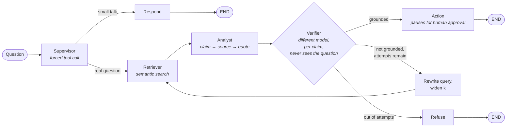
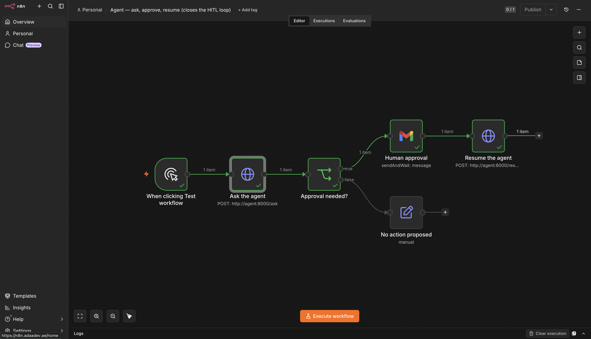
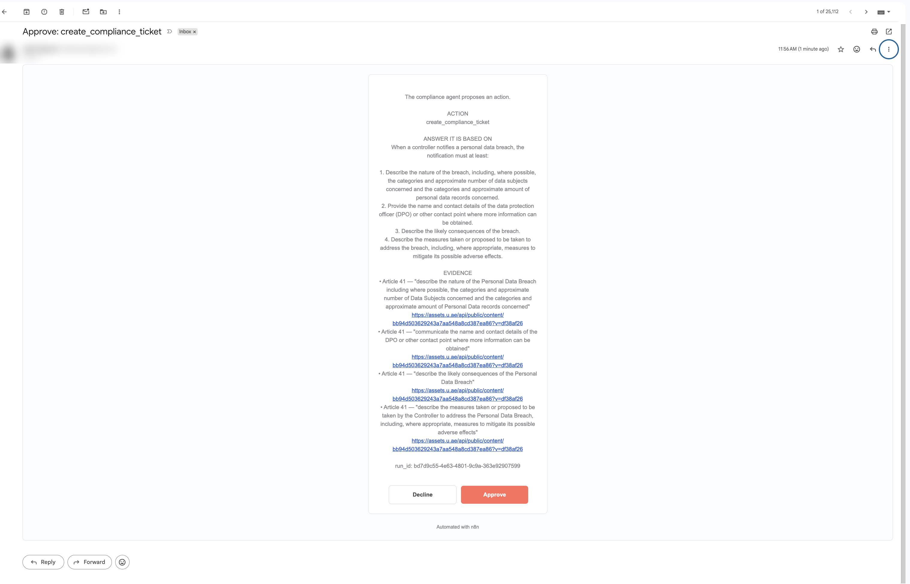
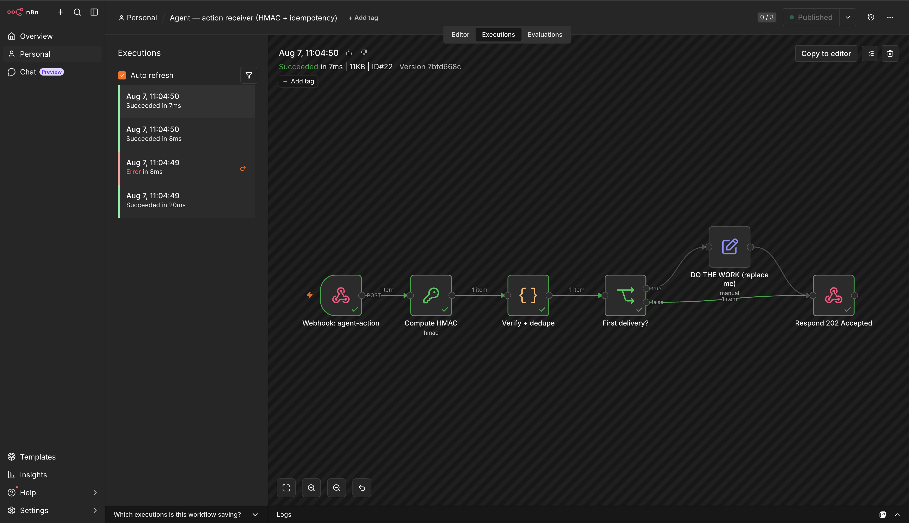
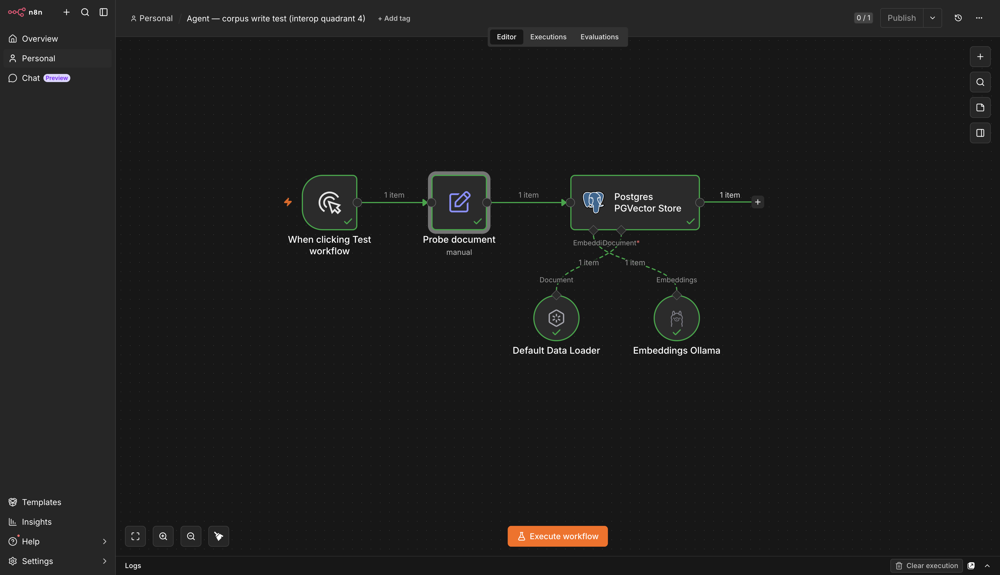

# Compliance Copilot

**An AI assistant for regulatory documents that cites its sources, refuses to guess, and never acts without a human.**

A LangGraph supervisor/worker agent over a UAE regulatory corpus (DIFC Data Protection Law, CBUAE AML/CFT guidance), running as a fourth service alongside a self-hosted n8n stack. Document text never leaves the building.


[](https://github.com/HaifaAljundi/compliance-copilot/actions/workflows/tests.yml)


---

## The problem

A compliance officer gets asked: *"We had a data breach — what do we have to report, and how fast?"*

Answering it means knowing **which** regulation applies, finding the **specific article**, quoting it **accurately** (a paraphrase is not defensible to a regulator), **acting** on it, and being able to show **why** months later. Steps 1–3 take 20–40 minutes of searching PDFs. Steps 4–5 get done inconsistently.

A general-purpose chatbot makes this worse, not better. It returns a confident, fluent, plausible answer with no way to tell whether it came from the actual regulation, a similar regulation from another jurisdiction, or the model's imagination.

| Failure mode | What it looks like | Consequence |
|---|---|---|
| **Hallucinated citation** | "Under Article 47(3)…" — an article that doesn't exist | Filing built on nothing |
| **Right topic, wrong source** | Quotes GDPR when DIFC law applies | Wrong deadline, wrong regulator |
| **Confident answer, no coverage** | Answers a question the documents don't address | Undetectable until audit |

For most work an 85%-accurate answer is useful. For compliance, **a confidently wrong citation is worse than no answer at all**, because it gets acted upon.

---

## What it does

Two questions, ninety seconds apart.

**Question 1 — the documents have the answer.**

> *"We had a personal data breach affecting client records. What must we include in the notification to the Commissioner, and how quickly must we report it?"*

Answered in **7.6 seconds** with **5 citations**, each carrying the exact section (`Article 41`), the **verbatim quote** it relied on, and a link to the source PDF. Then it **stopped and asked permission** before opening a compliance ticket.

**Question 2 — the documents do not.**

> *"How many days do we have to notify affected employees under UAE labour law?"*

Plausible. Adjacent. Genuinely not in the indexed corpus.

> I cannot answer this from the available sources. After 3 retrieval attempts, no passage in the corpus supports a grounded answer. Closest material reviewed: Article 1, Article 21, Article 33, Article 53, Section 1.3.

**0 citations. No ticket created. No action taken.**

Anything can answer question 1. Refusing question 2 — correctly, every time, without being told which questions are answerable — is the product.

---

## How it works



### The four guarantees, and how each is enforced

**1 · Every claim is tied to a real quote.** The analyst produces a structured `claim → source → quote` record for every factual statement. Before anyone sees the answer, a deterministic check — no AI involved, just text matching — asks whether the cited passage exists in what was retrieved and whether the quote is a **literal substring** of it. Anything failing is discarded. Costs nothing, runs in milliseconds, and catches the two most common hallucination types. *In testing this check alone rejected 12–30 fabricated citations per evaluation run.*

**2 · A second, different model checks the first one's work.** A separate model from a different vendor family is shown **one claim and one passage at a time** and asked: *does this passage state this claim, yes or no.* It is deliberately **not shown the original question** — given the question, a model reasons toward the answer seeming reasonable and fills gaps from its own knowledge. `config.py` refuses to start if the verifier and analyst are the same model; a model grading its own work approves it over 95% of the time, which would make the check theatre.

**3 · If the evidence isn't there, it searches differently — then gives up.** When verification fails, the system asks the checker *what specifically was missing*, turns that into a new query, and widens the search. A repeated search is refused outright — each attempt must differ, or the loop just pays three times for the same conclusion. After three attempts it stops and says so. **For compliance, "the documents don't cover this" is a correct and useful answer.**

**4 · Nothing happens without a human.** When the agent concludes an action is warranted, it does not do it. It freezes mid-execution via LangGraph `interrupt()`, writes its state to disk, and sends a human the proposed action **together with the answer and all the evidence**. The reviewer sees the reasoning, not just a button. **The pause survives a restart** — verified by killing the container mid-pause and resuming afterwards.

---

## Screenshots

### Human-in-the-loop: ask → pause → approve → resume

The workflow that makes the integration a system rather than a demo. n8n asks the agent a question carrying a proposed action; the agent answers, verifies, reaches the action node, and pauses. n8n shows a human the answer and its evidence, waits, then calls `/resume` — which continues **from the checkpoint** and fires the outbound webhook.



### The approval a human actually receives

The action, the answer it is based on, every citation with its verbatim quote and source link, and the `run_id` that makes the whole thing idempotent. Approving `create_compliance_ticket` with no visible justification would be rubber-stamping with extra steps.



### Action receiver — HMAC + idempotency

Header Auth proves the caller knows the shared secret; HMAC-SHA256 over the **raw** body binds that secret to the exact bytes sent, so a body that doesn't match its digest is rejected; dedupe on `run_id` proves a retried delivery doesn't become a second ticket. Responds **202 Accepted**, never 200 — a long compliance workflow must not hold the HTTP connection open.

One honest caveat: the signature is keyed on the *same* secret the header carries in cleartext, so it's a second gate on one credential rather than independent proof of integrity — anyone who can read a request can re-sign an altered one. Giving the signature its own key is a one-setting change and is noted in `app/tools/n8n.py`.



### Corpus write test — proving the interop contract

The corpus is written and read by two different LangChain implementations, in two languages, whose column-name defaults disagreed on three of four columns. `store.py` deliberately creates the table to match n8n's defaults, so the side a human configures by hand has nothing to get wrong. **The point of this workflow is what you don't configure.**



---

## Where it runs, and what leaves the building

```
   Your documents  ──▶  Local database (never leaves)
                              ▲
                              │
   Question  ──▶  Assistant ──┘
                     │
                     └──▶  Language model API  ── only the question
                                                  + the few paragraphs retrieved
```

| Component | Where it runs | What it sees |
|---|---|---|
| Document storage & search | **Your server** (pgvector) | Everything |
| Document indexing (embeddings) | **Your server** — local Ollama model | Everything |
| Answer writing & checking | External API (Groq) | The question + retrieved excerpts only |
| Workflow automation | **Your server** (n8n) | Everything |
| Approval records | **Your server** | Everything |

The full corpus is never uploaded anywhere. Indexing runs on a local model with no internet access. For clients who cannot accept even the excerpt egress, the answer-writing step can run on a local model too — a configuration change, not a rebuild.

---

## Evidence

Measured on the running system, not estimated.

**Retrieval accuracy** — 98% correct source in top 5, 100% in top 10, over 52 answerable + 15 unanswerable test questions. Questions were generated from the **body text** of the regulations, not from section headings; a question written from a heading contains the words that find it, which flatters the result. Questions naming their own article number were rejected outright.

**Response time and cost** — ~9 s typical, ~32 s at p95, ~$0.003 per question. The slow tail is questions the system had to search for repeatedly before refusing. **Refusing correctly costs more than answering easily** — that is the trade being made.

**What the verifier actually buys** — same questions, same models, same settings, only the verifier switched off:

| | Without verifier | With verifier |
|---|---|---|
| Answers fully supported by sources | 95% | 98% |
| Correctly refused unanswerable questions | 100% | 100% |
| Fabricated citations caught | 12 | 30 |
| Response time (p95) | 15 s | 32 s |
| Cost per question | $0.0010 | $0.0028 |

**Honest reading:** on this corpus the verification loop improves groundedness by about 2 points for roughly 2.7× the cost — small enough to sit within run-to-run variation. Reported as found rather than tuned to look better. What is clearly doing the work is the **free, deterministic citation check**, which runs in both arms and rejects fabricated sources at no cost. The useful conclusion: *structured citations are what make groundedness checkable at all; AI-based checking is the marginal addition.*

---

## Stack

**Python 3.11** · **LangGraph 1.2** · **LangChain 1.3** · **FastAPI** · **PostgreSQL 16 + pgvector** · **Ollama** (local embeddings, `nomic-embed-text`, 768-dim) · **Groq** (inference) · **n8n 2.31.6** · **Docker Compose** · **Caddy** (TLS upstream) · **pf** (host firewall)

Four containers on one Mac, ~4 GB RAM. No cloud account, no per-seat licence, no data-processing agreement with a document-storage vendor — because there isn't one.

Notes for anyone changing this:

- The supervisor is a **forced tool call**, not the `langgraph-supervisor` library — the model cannot answer in prose or hedge.
- `retrieved` uses the **overwrite** reducer. With `operator.add`, each loop-back accumulates chunk sets: 3× context cost, and chunks that already failed verification get resubmitted.
- Structured schemas use `Literal["yes","no"]`, never `bool` — `qwen/qwen3.6-27b` emits `"true"` as a string and Groq rejects the tool call server-side.
- `reasoning_format="hidden"` on every model — Groq returns chain-of-thought inline in `content`, and naive parsing once produced the literal search query `"<think>"`.
- Direct dependencies and container images are **pinned exactly**, never `:latest`. An agent whose behaviour changes because a transitive prompt template was reworded upstream is not debuggable.

---

## Repository layout

```
.
├── docker-compose.yml          # 4 services: postgres, pgvector, n8n, agent
├── .env.example                # infra secrets template (real .env is gitignored)
├── backup.sh / restore.sh      # encrypted backups incl. N8N_ENCRYPTION_KEY
├── caddy/  launchd/  pf/       # reverse proxy, scheduled backup, host firewall
├── pgvector/initdb/            # vector extension bootstrap (source, not a dump)
├── RUNBOOK.md                  # bring-up, firewall, upgrades, backups, failure modes
├── AI-FEATURES-DESIGN.md       # design notes for the n8n-side AI features
├── PRESENTATION.md             # the non-technical walkthrough this README condenses
├── docs/screenshots/           # the images above
└── agent/
    ├── app/
    │   ├── graph/              # state, edges, build + nodes/ (supervisor, retriever,
    │   │                       #   analyst, verifier, action, responder, refuse)
    │   ├── retrieval/          # corpus chunking, ingestion, pgvector store
    │   ├── tools/n8n.py        # signed outbound webhook + retry/idempotency
    │   ├── api.py  config.py  llm.py
    │   └── ui/index.html       # minimal streaming demo UI
    ├── evals/                  # recall@k, gold-set generation, A/B harness
    ├── tests/                  # 65 tests (59 need no network and no database)
    ├── n8n-workflows/          # 3 paste-ready workflows + import guide
    ├── Dockerfile  pyproject.toml  .env.example
    └── HOW-IT-WORKS.md         # the deep technical walkthrough
```

---

## Quick start

Requires Docker (Colima or Desktop), Ollama on the host, and `uv`.

```bash
git clone https://github.com/HaifaAljundi/compliance-copilot.git
cd compliance-copilot

# 1. Infra secrets
cp .env.example .env            # then fill in — see the comments in the file
umask 177                       # .env should be chmod 600

# 2. Agent secrets
cp agent/.env.example agent/.env
#    PGVECTOR_PASSWORD must MATCH the value in ./.env — same database, two readers

# 3. Local embedding model
ollama pull nomic-embed-text

# 4. Bring the stack up
docker-compose up -d

# 5. Ingest the corpus (from the host, hence the loopback overrides)
cd agent && uv venv && uv pip install -e ".[dev]"
PGVECTOR_HOST=127.0.0.1 PGVECTOR_PORT=5433 OLLAMA_BASE_URL=http://127.0.0.1:11434 \
  python -m app.retrieval.ingest
```

Then import the three workflows in `agent/n8n-workflows/` — the README there covers the credentials they need and the order to do it in.

```bash
pytest -m 'not integration'   # 59 tests, no network, no containers
python -m evals.metrics       # recall@3/5/10 — run this FIRST on any new corpus
python -m evals.run_ab        # A/B with and without the verifier → results.csv
```

See [`RUNBOOK.md`](RUNBOOK.md) for firewall, TLS, backups, upgrades, and failure modes, and [`agent/HOW-IT-WORKS.md`](agent/HOW-IT-WORKS.md) for the full technical walkthrough.

### API

| Endpoint | Caller | Purpose |
|---|---|---|
| `POST /ask` | n8n, UI | Ask a question; returns answer + resolved citations |
| `POST /ask/stream` | UI | SSE, one event per node — makes the retry cycle visible |
| `POST /resume` | n8n approval workflow | Releases a graph paused at the approval gate |
| `POST /ingest` | n8n schedule/watch | Re-ingest a document by `doc_id` |
| `GET /healthz` | container healthcheck | The only unauthenticated route |

All except `/healthz` require `Authorization: Bearer $AGENT_API_KEY`.

---

## Honest limitations

Stated plainly, because a compliance product that oversells itself is the wrong product.

- **The corpus is small.** Three documents. Adding more is routine, but retrieval accuracy on a 50-document corpus has not been measured and should not be assumed identical.
- **It is an assistant, not an authority.** It finds and quotes what the documents say. It does not interpret ambiguity, weigh conflicting provisions, or replace professional judgment. Every answer is designed to be checked against the source — that is why the quotes and links are there.
- **Coverage is exactly the documents indexed.** "It refused" and "no such rule exists" are different statements.
- **The evaluation is a single run.** No variance bars. Directionally sound, not publication-grade.
- **Gold-set bias.** 31% of generated questions contain an explicit locator ("Under DIFC Article 35…") because the generator prompt included the section label. Those are easier than real user questions, so recall is optimistic.
- **Amended regulations must be re-indexed.** Automatable on an n8n schedule, but if a document changes and nobody re-indexes it, the assistant will confidently cite the old version. This is the highest-risk operational failure mode.
- **One demo shortcut:** the built-in web UI passes its access key in the URL. Fine on a private machine, unsuitable for shared deployment — a real rollout needs proper login.

### Next steps

Prove it on a client's actual documents (retrieval accuracy is corpus-specific; everything else is engineering that already works) · expand the test set, especially questions that *should* be refused · route only low-confidence answers through full verification instead of paying for it every time · automate corpus freshness against regulator publication pages.

---

## License

[MIT](LICENSE) — © 2026 Haifa Aljundi.

The regulatory documents this system indexes are not distributed here. They are published by the DIFC and the Central Bank of the UAE, re-fetchable from their source URLs, and carry their own terms; `agent/corpus/` is gitignored for that reason.

---

## Security

The two `.env` files are gitignored and never committed. `N8N_ENCRYPTION_KEY` is the single point of unrecoverability — if it changes, every saved n8n credential becomes unreadable; it is backed up inside every archive by `backup.sh` and must never be logged or committed. The agent's `.env` is deliberately separate from the infra `.env` so that this newer, less-proven service never reads that key.
